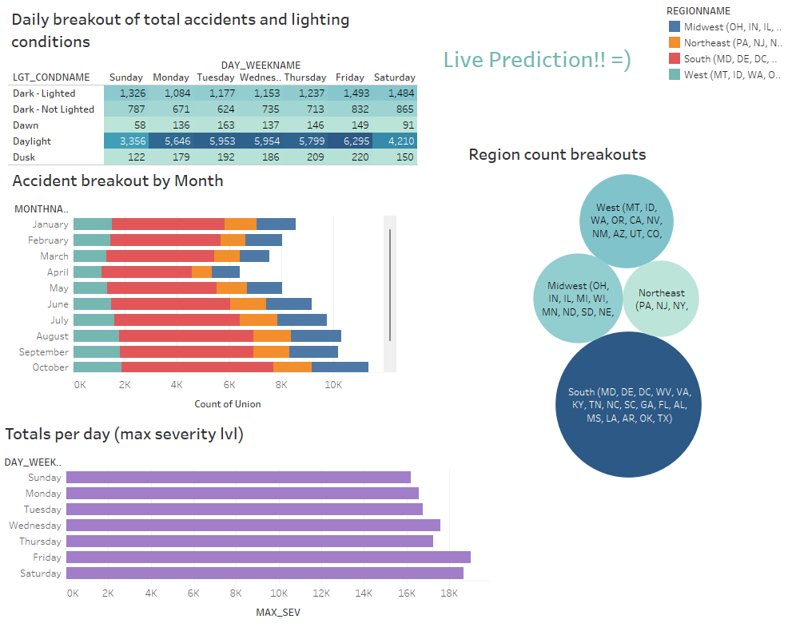

# Predicting Fatal Accidents 
[Google Slides](https://docs.google.com/presentation/d/1VzghETdmlK60Soo-7PjKGphlrD8UF2DXXCA79tSqfJ0/edit?usp=sharing) 
[Tableau Workbook](https://public.tableau.com/app/profile/josh.slagle/viz/AccidentDataFinal/Story1?publish=yes) 
[Heroku Prediction app](https://car-accident-prediction.herokuapp.com/) 

## Team Introduction
- Josh Slagle, jslagle1982@yahoo.com

- Darlene Penn, dyvonnep@gmail.com

- Sierra Dubois, sdubois@kent.edu

## Communication Protocol
Team communicates daily via Slack messages for progress updates on individual components; meets weekly via Zoom for group components, brain storming, problem solving, coding, etc. 

## Topic
Our topic will be surrounding automotive collision data, and predicting accidents based on a number of common conditions. We will analyze whether or not certain environmental conditions contribute to the frequency and/or severity of automotive accidents in the U.S.  We will be looking to see what impact the conditions play in how likely an accident is to result in fatalities, based on the weather, make & model of the vehicle, weight of the car, geographical region of the location, the light conditions and the time of the year (in months). We will exam the years of 2019 and 2020 to ensure we have a large enough data set to train the machine learning model. 

## Topic Selection
We decided on this topic after brainstorming different areas of interest for each group member.  It was revealed that one group member was employed in the automotive industry and was familiar with some aspects of collision data. They suggested car crashes and different factors that could influence them.  After a brief discussion, other group members stated an interest in the topic and we can to a concensus that car crash data would provide many avenues of analysis, so we would have a broad range of options to examine the data for desired outcomes. 

## Description of Source Data
One of our main sources of data will be from the NATIONAL HIGHWAY TRAFFIC SAFETY ADMINISTRATION (NHTSA) and their Crash Report Sampling System (CRSS).  Crash Report data collected by law enforcement agencies are obtained by NHTSA coders and interpreted into a confidential electronic data file.  Personal information such as names addresses, licence and registgration information is removed, and the dataset is coded into a common format using 120 elements.  After being validated for consistency, the documentation becomes available to the public.  We will be using a selection of data for 2019 and 2020. 

## Questions for Analysis
We hope to answer some of the following questions with our analysis:
- Are some make and models of vehicles more prone to fatal accidents?
- What kinds of weather conditions have the greatest impact on the frequency and severity of vehicle accidents?
- Are some parts of the country less safe for driving based on the number of fatal accidents occurring annually, and what elements are influencing that fatal accident rate?
- Can we predict whether an accident will be fatal if we have the given conditions at that moment, like the make and model of the car, the current weather, and the location of the driver and time of the year?
- Which factors increase the rate of fatality vs. non-fatal accidents?

## Exploratory Analysis

### Initial Findings
We noticed some trends with the data right away. For example, the vast majority of the reported acccidents were not fatal and only resulted in property damage. Since we were only interested in fatal vs. non-fatal, all non-fatal accidents were grouped together with our outcomes column.

Many accidents happen during the holiday months.

Bad weather conditions do not equate to more accidents, as shown below many happen during clear skies and fair weather.

## ETL Process

### *Extract* Data
  - Data was taken from NHTSA website

#### [2019 Data](https://www.nhtsa.gov/file-downloads?p=nhtsa/downloads/CRSS/2019/)
#### [2020 Data](https://www.nhtsa.gov/file-downloads?p=nhtsa/downloads/CRSS/2020/)

  - We used accident.csv and vehicle.csv for our analysis 
  - Narrowed down the files to inlcude only columns we believe could likely affect car crash fatalities 
    - From the accident.csv, accident case number, region, urbanicity (rural or urban), month, year, day of the week, light condion, weather
    - From the vehicle.csv, accident case number, make and model, vehicle's year
    - Note: we did not end up using every variable in our database in our final analysis
  - Joined accident.csv and vehicle.csv on accident case number

### *Transform* Data

  - Outcome column was created from the MAX_SEV column 
  - If MAX_SEV = 4 (Fatal Crash), then outcome = 1 

- For accident csvs, removed light condition and weather options that were unknown or weren't specifically reported

#### accident2019 data transformation
 
#### accident2020 data transformation

- For vehicle csvs, removed two years that are not real

#### vehicle2019 data transformation
 
#### vehicle2020 data transformation
 

### *Load* Data into Postgresql Database

#### Create fatal_accident_db in pgAdmin
 

#### Create accident2019 and accident2020 tables
 

#### Create vehicle2019 and vehicle2020 tables
 

#### ERD 
 

### Upload Data

 

## Machine Learning Process

Started with a Classification Model (Logistic Regression) since we are classifying our data into two categories: fatal (1) or non-fatal (0)

Split dataset using scikit-learn's train_test_split()  
X: outcome  
y: region, month, light_condtion, weather, make_and_model, year

** NOTE: year refers to the vehicle's year not the calendar year

#### Classfication Model Results
 

This model's accuracy is 98% but that's simply due to the fact that are dataset is greatly imbalanced. Majority of accidents will be non-fatal, and the model recognizes that and will cleverly always predict 0 to achieve high accuracy. 

Because of this imbalance, we decided to test models that would help balance the data. See below the results of multiple models on our dataset.

#### Native Random Oversampling Results
 

#### Smote Oversampling Results
 

#### Undersampling Results
 

#### Combination Sampling (Over and Under) Results

#### BalancedRandomForestClassifier Results

#### BorderlineSMOTE Results

## Final Model Decision

After reviewing the results of the models, it came down to choosing either the BalancedRandomForestClassifier model or Native Random Oversampling model. Both models have similar accuracy scores (around 62-63%). 

We decided to go with the BalancedRandomForestClassifier model due to the recall score for fatal car accidents being higher compared to the Native Random Oversampling model. Recall/sensitivity calculates how many of the Actual Positives our model captures. If our model is going to predict if someone gets into a fatal accident or not, then having high sensitivity is very important. 

## Creating Flask App for Model
The purpose of this app is to give an interactive experience with our machine learning model. Due to project time constraints, we created a new model that didn't include make_and_model and year. Both variables have too many options to write into the html code (make_and_model with 500+ and year 90+). We still used the BalancedRandomForestClassifier model for the heroku app after testing it against the Native Random Oversampling model. The results were still in favor of that model.

X: outcome  
y: region, month, light_condtion, weather

#### BalancedRandomForestClassifier Results

#### Save the Model using Pickle

### Create app.py and HTML files

Connect to saved model using Flask in app.py. Created two webpages: index.html (ask for input from user) and results.html (contains prediction).

## Deploy App using Heroku

#### Pushed app to Heroku using git
Steps in Process:
  - Installed Heroku CLI in virtual environment
  - Installed gunicorn in virtual environment and created Procfile in app root directory (this is how the app and Heroku communicate)
  - Created requirements.txt and Pipfile in root directory
  - Initialized git in virtual environment
  - Add contents in directory to git
  - Commit and push to Heroku app 

Link to App: https://car-accident-prediction.herokuapp.com/

## Dashboard 

### Dashboard Rough Draft
 

### Dashboard Final Version

